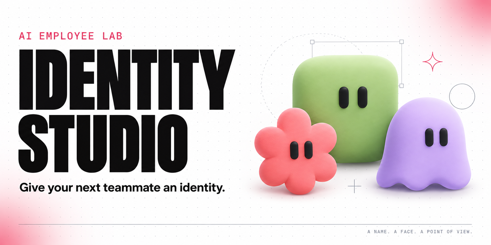
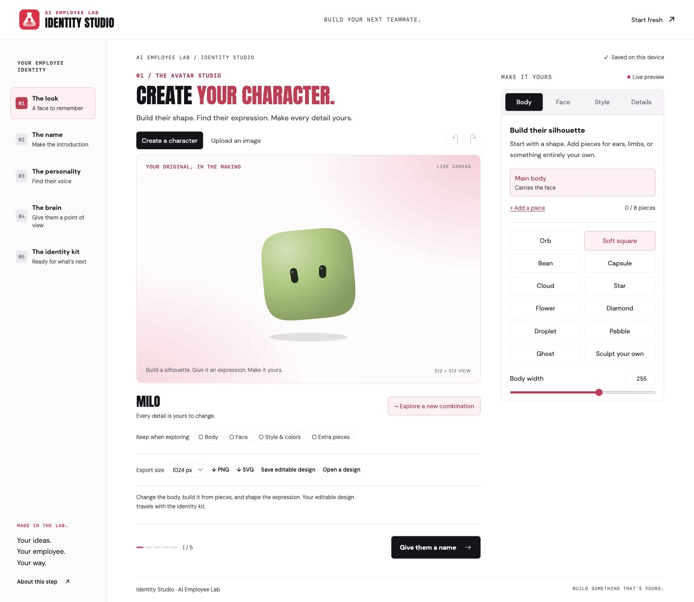

<p align="center">
  
</p>

<h1 align="center">Identity Studio</h1>

<p align="center">
  <strong>A name. A face. A point of view.</strong><br />
  Create the identity behind your next AI employee, then take the whole kit with you.
</p>

<p align="center">
  <a href="https://github.com/silentobelisk/identity-studio/releases/latest"></a>
  <a href="LICENSE"></a>
  <a href="#download--get-started"></a>
  <a href="docs/GUIDE.md#your-data"></a>
</p>

<p align="center">
  <a href="https://github.com/silentobelisk/identity-studio/releases/latest/download/identity-studio.zip"><strong>Download Identity Studio ↓</strong></a>
  &nbsp; · &nbsp;
  <a href="#download--get-started">Quick start</a>
  &nbsp; · &nbsp;
  <a href="docs/GUIDE.md">User guide</a>
  &nbsp; · &nbsp;
  <a href="https://www.skool.com/aiemployeelab">AI Employee Lab ↗</a>
</p>

---

**Give your AI employee a sense of self before you build.** Shape an original avatar, choose a name, tune its personality, and write the principles it will work by. Identity Studio packages it all into a portable ZIP for your next project.

Runs locally in your browser. No account, API key, paid service, or dependency installation required.

## Download & get started

1. **[Download the latest ZIP](https://github.com/silentobelisk/identity-studio/releases/latest/download/identity-studio.zip)** and unzip it.
2. Install **[Node.js 22 or newer](https://nodejs.org/)** if you don’t have it yet.
3. Open Terminal on macOS/Linux or PowerShell on Windows **inside the unzipped `identity-studio` folder**, then run:

   ```sh
   npm start
   ```

4. Open **[localhost:4173](http://localhost:4173)** in your browser.

That’s it. You can skip `npm install`. Keep the terminal open while you work; press `Ctrl+C` to stop the studio. Open the localhost link, rather than double-clicking `index.html`.

<details>
<summary><strong>Prefer to clone the source?</strong></summary>

```sh
git clone https://github.com/silentobelisk/identity-studio.git
cd identity-studio
npm start
```

The [main-branch ZIP](https://github.com/silentobelisk/identity-studio/archive/refs/heads/main.zip) contains the latest source, which may be ahead of the release. Its extracted folder is named `identity-studio-main`.

</details>

## Meet the studio



| Make it yours | What you can do |
| --- | --- |
| **The look** | Sculpt a character, edit each eye, assemble body pieces, and choose colors, accessories, and four rendering styles. Or upload your own picture. |
| **The name** | Give your teammate a name, role, and optional pronouns. |
| **The personality** | Choose traits and tune warmth, detail, and energy with a sample introduction. |
| **The brain** | Define purpose, working context, principles, and boundaries. |
| **The identity kit** | Download the avatar, written identity, voice guidance, and editable source in one ZIP. |

Undo, redo, lock your favorite details, and explore new combinations. Export your character as SVG or PNG at 512, 1024, or 2048 pixels. The live identity card follows your choices.

## One download. A complete identity.

```text
milo-identity-kit.zip
├── START-HERE.md       Where to go next
├── IDENTITY.md         Name, role, pronouns, and personality
├── BRAIN.md            Purpose, context, principles, and boundaries
├── VOICE.md            Tone settings and a sample introduction
├── avatar.png          Ready-to-use profile picture
├── avatar.svg          Scalable character artwork
├── avatar-design.json  Editable avatar construction
├── avatar-prompt.md    A prompt for future visual variations
└── identity.json       Portable profile to reopen in the studio
```

SVG and avatar-design files are included for characters built in the studio. Uploaded pictures and older gallery identities use image-based exports.

Bring the kit into your AI employee project with a prompt like:

> Read this identity kit and use it as the foundation for my AI employee. Ask me about its responsibilities and workflows before implementing anything.

The kit supplies identity and written guidance. Workflows, tools, integrations, and the running employee are the next step.

## Your work stays with you

- **On your device:** avatar editing, image processing, and ZIP creation happen in your browser. The app sends no identity data or images to a server.
- **Saved as you go:** one current draft is stored in this browser. Download a kit before clearing browser data or switching devices.
- **Easy to reopen:** import `identity.json` from **The identity kit** step to keep editing. Import replaces the current draft.
- **Self-contained:** fonts and artwork ship with the app. No font CDN, analytics, or AI provider calls.

## Help, details & development

- **[User guide](docs/GUIDE.md)** — avatar controls, identity kits, imports, and saved drafts.
- **[Development & hosting](docs/DEVELOPMENT.md)** — project structure, local server, and static deployment.
- **[Contributing](CONTRIBUTING.md)** — report a bug, suggest an improvement, or make a change.
- **[Release notes](CHANGELOG.md)** — what’s new in Identity Studio.
- **[Design direction](docs/DESIGN.md)** · **[Validation notes](docs/VALIDATION.md)**

<details>
<summary><strong>Having trouble starting?</strong></summary>

- **“npm not found” / “npm is not recognized”:** install Node.js, then close and reopen your terminal.
- **“Could not read package.json”:** make sure the terminal is inside the extracted project folder, next to `package.json`.
- **“Address already in use”:** another local server is using port 4173. Stop your earlier studio terminal with `Ctrl+C`, or see [how to use another port](docs/DEVELOPMENT.md#using-another-port).
- **A blank page after opening the HTML file:** run `npm start` and use the localhost link above.

</details>

---

<p align="center">
  <br />
  <strong>Made in the Lab.</strong><br />
  <a href="https://www.skool.com/aiemployeelab">AI Employee Lab</a> · Your ideas. Your employee. Your way.
</p>

Code is [MIT licensed](LICENSE). Bundled fonts use the SIL Open Font License; their licenses are in `docs/`. The AI Employee Lab name and logo are brand assets and are not covered by the code’s MIT license.
